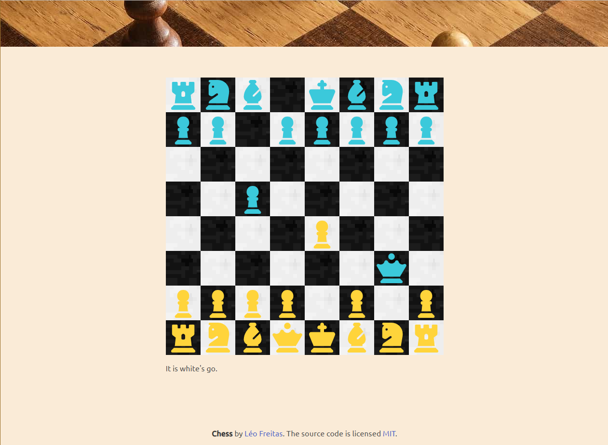

# Chess Web

A chess web game is an online platform that allows users to play the game of chess over 
the internet. It provides a virtual representation of a chessboard and all the necessary 
pieces, enabling players to make moves by clicking and dragging the pieces.

